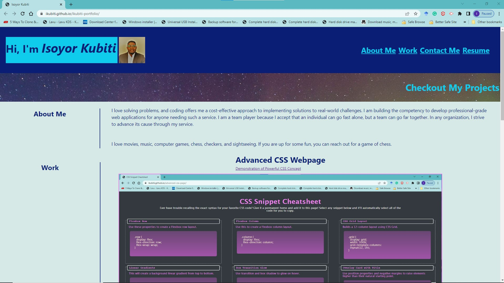
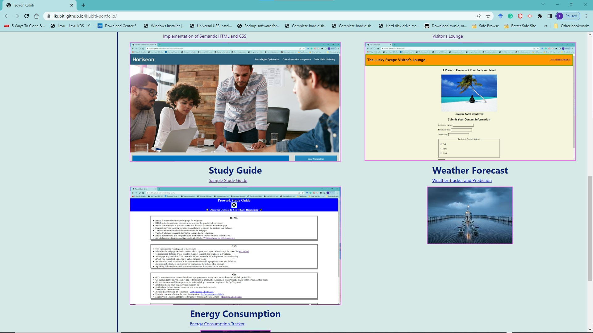
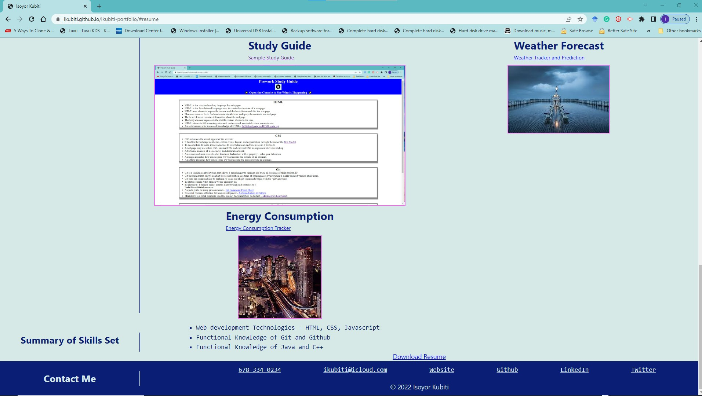
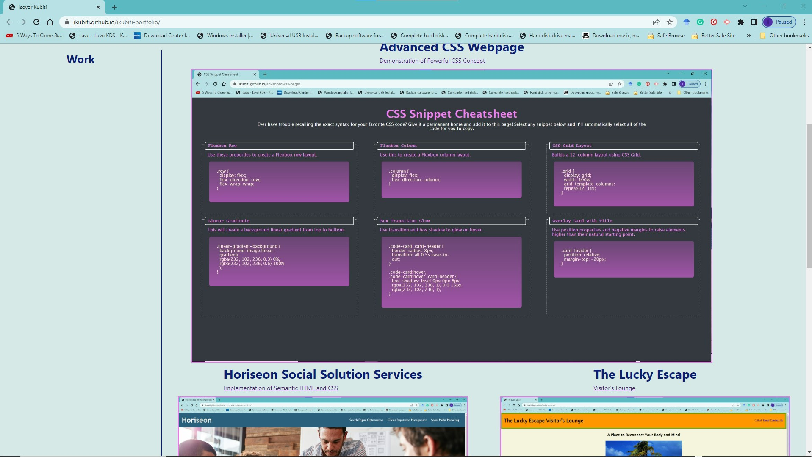
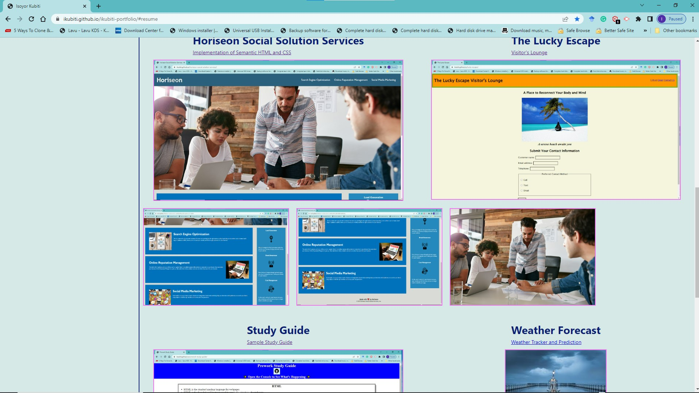

# ikubiti-portfolio

## Description

As a potential full-stack developer, having a portfolio that showcases my skills and talents enhances my ability to attract the right employers. This project is my first attempt at building such a showpiece and I will continue to improve on this with the new techniques and knowledge I acquire. My objectives for this webpage based on the following user story and acceptance criteria;

### User Story

```
AS AN employer
I WANT to view a potential employee's deployed portfolio of work samples
SO THAT I can review samples of their work and assess whether they're a good candidate for an open position
```

### Acceptance Criteria

```
GIVEN I need to sample a potential employee's previous work
WHEN I load their portfolio
THEN I am presented with the developer's name, a recent photo or avatar, and links to sections about them, their work, and how to contact them
WHEN I click one of the links in the navigation
THEN the UI scrolls to the corresponding section
WHEN I click on the link to the section about their work
THEN the UI scrolls to a section with titled images of the developer's applications
WHEN I am presented with the developer's first application
THEN that application's image should be larger in size than the others
WHEN I click on the images of the applications
THEN I am taken to that deployed application
WHEN I resize the page or view the site on various screens and devices
THEN I am presented with a responsive layout that adapts to my viewport
```

## Installation

Please visit https://ikubiti.github.io/ikubiti-portfolio/

## Usage

My portfolio consists of four sections: about me, work, contact me, and resume. The links in the navigation bar will send the visitor to the requested section. Hovering over each project reveals further details about the project. Each project also has a link that sends the visitor to its landing page. The contact me section also links my social media handles, phone number, and email. The webpage is also designed for different screen sizes and is very responsive. The pictures below are from the application; please visit for more information and a great user experience. 

The image below is the landing page a visitor gets when they enter the website address.



Scrolling down the page shows more projects



Resume and Contact Me sections at the bottom of the page



The main project in my portfolio has a prominent display 



Hovering over any project display reveals more information just below it 



The webpage is responsive and displays an appropriate layout for all screen sizes 


## Credits

N/A

## License

Licensed under the [MIT](LICENSE.txt) license.